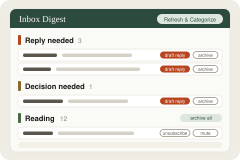

  

# Inbox Digest for Fastmail

  

Didn't work? Create a Studio workspace and paste this to your agent:
` /use-template https://github.com/benjuntilla/inbox-digest-fastmail`

## Why you care

A Fastmail inbox digest and one-click triage app: sorts your inbox into ten groups, lets you archive / mute / spam / unsubscribe in one click, drafts replies into Fastmail Drafts, learns from your corrections, and can run every morning with a heads-up.

Most of an inbox is newsletters, notifications, and cold pitches, and the few
messages that actually need you get buried. This sorts your Fastmail inbox into
ten groups every time you ask (or every morning on its own), so you see the
replies and decisions first and can clear the rest in a few clicks.

## How to use it

Once it is set up (connect Fastmail, then import your contacts), open the
**Inbox Digest & Review** window:

- **Refresh & Categorize** pulls your recent inbox and sorts every thread into
  ten groups: Reply needed, Decision needed, FYI, TODO, Sent / awaiting reply,
  Cold outreach, Marketing / spam / phishing, In-product notifications,
  Reading, and Work FYI. Each thread gets a one-line reason for where it
  landed.
- **One-click actions** on each row: archive, mute (stops follow-ups on the
  thread), mark as spam, or unsubscribe. Noisy groups have "archive all"
  and smart-action buttons at the top.
- **Draft reply** on threads that need a reply or a decision: Claude writes a
  draft and saves it in your Fastmail Drafts. You edit and send it from
  Fastmail -- the app never sends anything.
- **Move** a thread to a different group when the sorting got it wrong. The
  move sticks for that thread, and once you have moved the same sender's mail
  to the same group twice, it becomes a rule for everything they send.
- **Ask the agent** in chat -- "what do I need to reply to?", "what am I
  waiting on?", "import my Fastmail contacts" -- and it runs the same pipeline.
- **Morning heads-up (optional):** schedule the 7 AM run and you get a
  notification like "3 emails need a reply, 1 needs a decision" before you
  open your inbox.

To see what it has learned from your corrections, run
`uv run python system/scripts/review_email_moves.py`.

## Ideas for making it yours

- Add an eleventh group -- say "Receipts" -- by adding it to `RULES.md` and the
  group table, so purchase confirmations stop landing in Notifications.
- Change the morning run to a weekday-only or twice-a-day schedule, or have the
  heads-up name the senders instead of just counting them.
- Give the reply drafts your own voice: add a few of your past replies as
  examples to the drafting prompt in `drafts.py`.
- Auto-archive the Reading group after a week, so newsletters you never opened
  clear themselves.
- Point the same pipeline at a second Fastmail account or a shared mailbox.

## What this is

This repository is a published **Imbue Studio template**: a clean, bootable
snapshot of what an agent built, ready to adapt into your own. It is NOT the
generic workspace template -- it is this specific project.

[`template.md`](template.md) is the full manifest -- what it is, how it
works, what it needs to run, and what to adapt -- with the
machine-readable half (recipe, requirements, and the environment it needs
installed) in [`template.toml`](template.toml).
